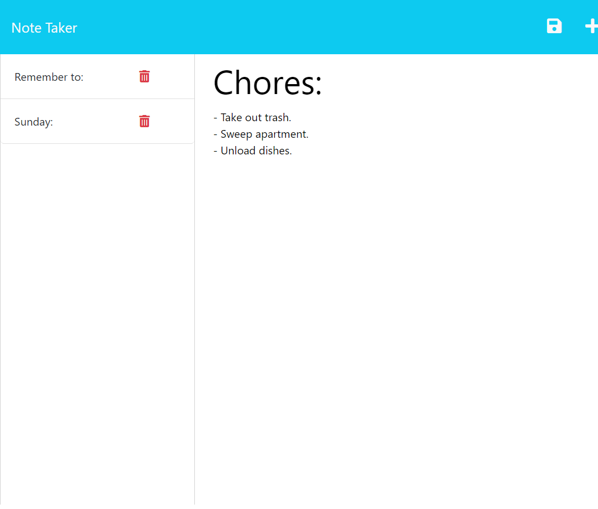

# Note Taker 

## Description:
An application called Note Taker that can be used to write and save notes. This application will use an Express.js back end and will save and retrieve note data from a JSON file.
## Table of Contents:
* [Installation](#installation)
* [Usage](#usage)
* [License](#license)
* [Contributing](#contributing)
* [Tests](#tests)
* [Questions](#questions)
### Installation:
git clone https://github.com/Samualjensen/note-taker.git
### Usage:

### License
MIT
### Contributing
N/A
### Tests
N/A
### Questions
My Github profile can be found at [Github](https://github.com/Samualjensen), or contact Sam Jensen at samual.jensen@gmail.com.